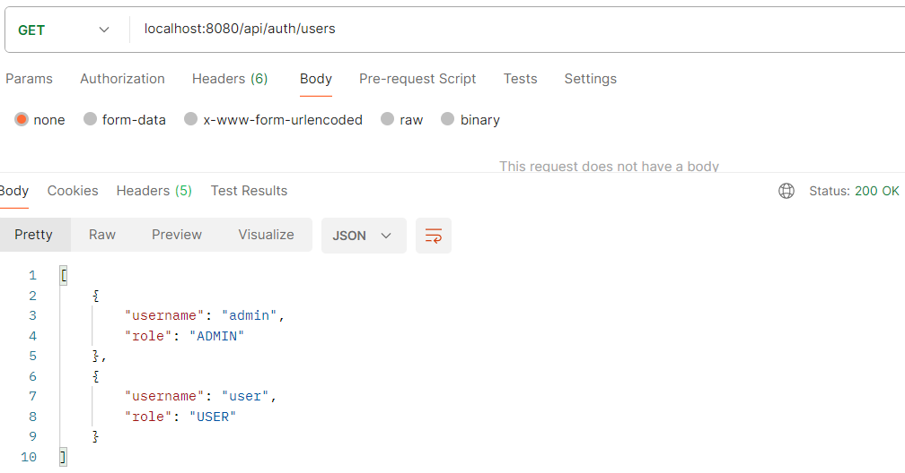
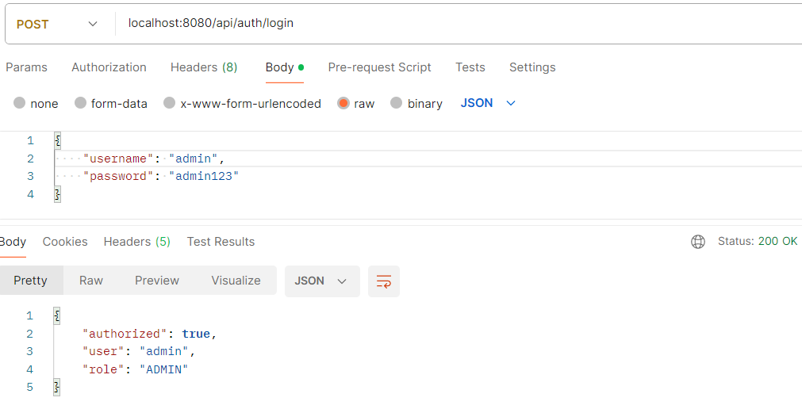
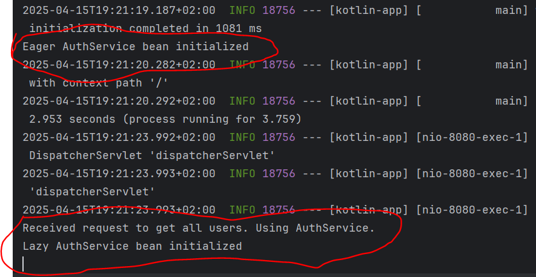

# kotlin-app

### Tests

- GET /api/auth/users returns list of UserDto (JSON representation)  

- POST /api/aut/login returns username, isAuthenticated, role (JSON representation)  

### Initialization

Eager: startup  
Lazy: lazy initialization (when needed)  

