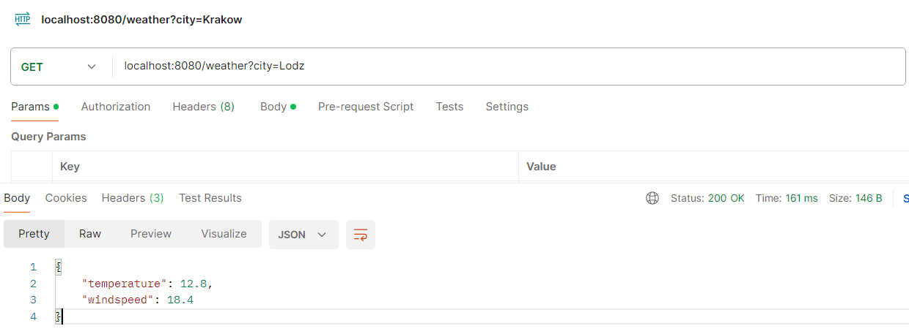
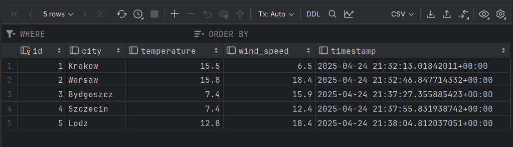

# weather-app

#### Run:
```bash
docker run --rm -it -v "$PWD":/app -w /app -p 8080:8080 golang:1.21 go run main.go
```

#### Test:
```
GET localhost:8080/weather?city=Lodz
```
Example response:
```json
{
  "temperature": 12.8,
  "windspeed": 18.4
}
```



#### Database:
`id, city, temperature, wind_speed, timestamp`  


#### Supported cities:
- Warsaw
- Krakow
- Wroclaw
- Gdansk
- Poznan
- Lodz
- Szczecin
- Bydgoszcz
- Lublin
- Katowice